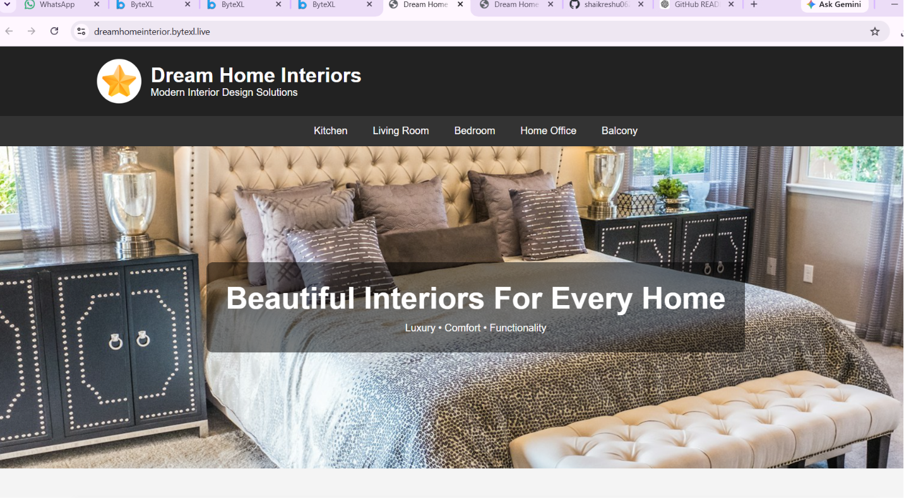

## 🚀 Live Demo
🔗 Demo Link:https://dreamhomeinterior.bytexl.live/
# 🏠 Home Interior Design Portfolio

A modern, responsive Home Interior Design Portfolio website built using HTML5 and CSS3. This project showcases elegant interior designs, room layouts, and apartment inspirations with a clean and user-friendly interface.

## ✨ Features

* Fully Responsive Design
* Modern UI/UX Layout
* Hero Section with Call-to-Action
* Living Room Gallery
* Bedroom Designs
* Kitchen Interior Showcase
* Apartment Layout Inspirations
* Testimonials Section
* Contact Information
* Mobile, Tablet, and Desktop Compatible

## 🛠️ Technologies Used

* HTML5
* CSS3
* Responsive Web Design
* Flexbox
* CSS Grid

## 📸 Screenshots

## 🚀 Live Demo

## 📂 Project Structure

Projects/
│
├── index.html
├── style.css
├── images/
│ ├── living-room.jpg
│ ├── bedroom.jpg
│ ├── kitchen.jpg
│ └── apartment.jpg
│
└── README.md

## 💻 Installation

1. Clone the repository

git clone https://github.com/shaikreshu0628-creator/Projects.git

2. Open the project folder

cd Projects

3. Run the project

Open index.html in your browser.

## 🎯 Future Enhancements

* Dark Mode
* More Interior Categories
* Interactive Gallery
* Project Filtering
* Contact Form Integration

## 👩‍💻 Author

Shaik Reshma

GitHub: https://github.com/shaikreshu0628-creator

## ⭐ Support

If you like this project, please give it a star on GitHub and share it with others.

---

Made with ❤️ by Shaik Reshma
